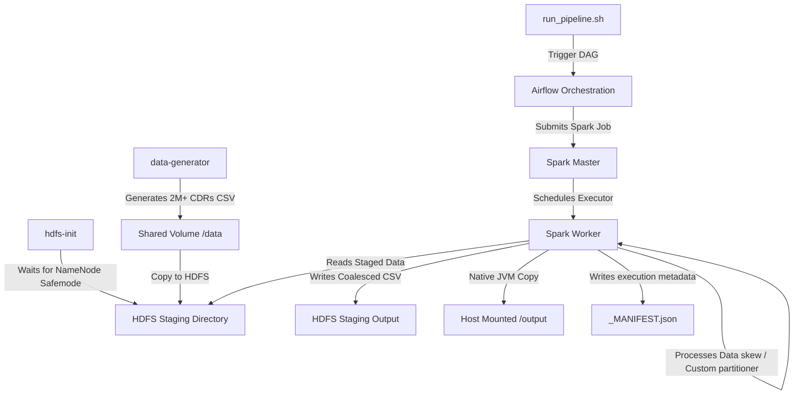

# 📊 Hadoop & Spark Batch Telecommunications Analytics Pipeline

Welcome to the **Hadoop & Apache Spark Batch Analytics Pipeline**—a production-grade distributed batch processing system built to ingest, store, partition, and analyze telecommunications **Call Detail Records (CDRs)** at scale.

This project simulates a real-world enterprise data engineering pipeline designed to handle billing calculations, network heatmaps, data-skew mitigation via custom partitioning, and fraud/anomaly detection.

---

## 🏛️ System Architecture

The pipeline orchestrates containerized services running HDFS, Spark, and Apache Airflow. The execution flow progresses from HDFS staging and custom partitioning to local host-mounted output directories.



---

## 🚀 Port Mapping & Service Registry

All services are accessible on `localhost` via the following port mappings:

| Service | Port (Host) | Internal Port | Description |
| :--- | :--- | :--- | :--- |
| **Apache Airflow UI** | `8080` | `8080` | Pipeline orchestration, DAG scheduling, & task status |
| **Apache Spark Master** | `8081` | `8080` | Spark Cluster Master Web UI |
| **Hadoop NameNode** | `9870` | `9870` | HDFS DFS Admin & storage overview |
| **Hadoop DataNode** | `9864` | `9864` | Data block storage overview (Internal/optional mapping) |

---

## ⚙️ Service Healthcheck Protocol

To ensure resilient and robust startup behavior without race conditions, Docker Compose enforces a strict dependency chain based on container health status:

```
[namenode (healthy)] ──> [datanode & spark-master (healthy)] ──> [hdfs-init (healthy/running)] ──> [airflow (healthy)]
                                                                    ▲
[data-generator (healthy)] ─────────────────────────────────────────┘
```

* **namenode**: curl healthcheck to `http://localhost:9870` with a `180s start_period` to safely handle NameNode safemode.
* **data-generator**: verified by checking for `/data/cdr_data.csv` generation.
* **spark-master**: curl healthcheck to `http://localhost:8080` (container internal).
* **hdfs-init**: verifies directory `/tmp/output` is staged and initialized.
* **airflow**: curl healthcheck to `http://localhost:8080/health`.

---

## 🛠️ Step-by-Step Setup Guide

Follow these steps to deploy and execute the pipeline:

### 1. Build and Launch the Containers
Bring up the entire system in detached mode. This command compiles the custom Airflow Dockerfile and triggers the automated HDFS configuration:
```bash
docker-compose up --build -d
```

### 2. Monitor Startup Progress
Verify the initialization logs for Spark, HDFS, and the Data Generator:
```bash
docker-compose logs -f hdfs-init
docker-compose logs -f data-generator
```

### 3. Check Service Status
Confirm that all containers are running and healthy (this can take 2–3 minutes due to safemode wait times):
```bash
docker-compose ps
```

---

## 📈 Triggering the Pipeline (CLI Transformation Layer)

The project includes an executable script `run_pipeline.sh` at the root that maps logical queries into physical Airflow DAG triggers.

### Usage Syntax:
```bash
./run_pipeline.sh <logical_query_name>
```

### Supported Queries:
| Logical Query Name | Airflow DAG ID | PySpark Script | Output Directory |
| :--- | :--- | :--- | :--- |
| **`top_callers`** | `top_callers_by_spend_dag` | `top_callers.py` | `/output/top_callers_by_spend/{run_id}/` |
| **`tower_heatmap`** | `tower_utilization_heatmap_dag` | `tower_heatmap.py` | `/output/tower_utilization_heatmap/{run_id}/` |
| **`anomalous_calls`** | `anomalous_call_detection_dag` | `anomalous_calls.py` | `/output/anomalous_call_detection/{run_id}/` |
| **`revenue_recon`** | `revenue_reconciliation_dag` | `revenue_recon.py` | `/output/revenue_reconciliation/{run_id}/` |

### Execution Examples:
```bash
# Calculate top 100 callers by total charges
./run_pipeline.sh top_callers

# Generate cellular tower utilization heatmap by hour
./run_pipeline.sh tower_heatmap

# Run anomalous call duration detection (using custom partitioner)
./run_pipeline.sh anomalous_calls

# Perform total revenue reconciliation
./run_pipeline.sh revenue_recon
```

---

## 📡 REST API & curl Administration Endpoints

If you wish to control, trigger, or monitor the pipeline programmatically, you can interface directly with the services via HTTP API curl requests.

> [!NOTE]
> The default credentials for Airflow REST API basic authentication are `admin` (username) and `admin` (password).

### 1. Check Airflow System Health
Queries Airflow's core health status, including database and scheduler connectivity:
```bash
curl -f -u "admin:admin" http://localhost:8080/health
```

### 2. Trigger a Batch Job (Airflow DAG)
Manually trigger a pipeline run. Replace `<dag_id>` with the DAG ID (e.g., `top_callers_by_spend_dag`):
```bash
curl -X POST "http://localhost:8080/api/v1/dags/<dag_id>/dagRuns" \
  -u "admin:admin" \
  -H "Content-Type: application/json" \
  -d '{"conf": {"run_id": "manual__20260521_111000"}, "dag_run_id": "manual__20260521_111000"}'
```

### 3. Get Status of a DAG Run
Retrieve the execution state (`queued`, `running`, `success`, or `failed`) of a specific run:
```bash
curl -X GET "http://localhost:8080/api/v1/dags/<dag_id>/dagRuns/manual__20260521_111000" \
  -u "admin:admin"
```

### 4. Check HDFS Status (WebHDFS REST API)
Check directory listings or details directly from the HDFS NameNode API:
```bash
curl -i "http://localhost:9870/webhdfs/v1/tmp/output?op=GETFILESTATUS"
```

---

## 🧠 Job Internals & Data Processing Engine

### 1. Data Skew & Whale Callers
The pipeline processes over **2,000,000 CDRs** generated via `data/generate_records.sh`. Telecommunications datasets suffer from extreme data skew because of high-frequency accounts (e.g., call centers, automated gateways) known as **Whales**.
- A predefined whale caller (`WHALE_CALLER_999`) generates exactly **10% of the total dataset** ($\ge 200,000$ rows) to simulate real-world cluster load and skew.

### 2. Custom Skew Partitioner (`anomalous_calls.py`)
To isolate caller metrics, the `anomalous_call_detection` job computes standard deviation ($3\sigma$) anomalies per user.
- **Custom Partitioner**: Uses a deterministic `zlib.crc32` hashing function to distribute all call records for any single user to a single partition/reducer.
- **Skew Handling**: The job utilizes a broadcast join for global stats on the `WHALE_CALLER_999` to bypass skew barriers, while calculating localized standard deviations efficiently for low-frequency callers.

---

## 📋 Execution Manifests

Every single pipeline execution produces a persistent `_MANIFEST.json` in the final host `/output/...` directory. It acts as an audit trail summarizing the physical execution.

### Example Manifest Schema:
```json
{
  "job_name": "anomalous_call_detection",
  "run_id": "20260521_111000",
  "execution_timestamp_utc": "2026-05-21T05:40:00.123456Z",
  "input_path": "/data/cdr_data.csv",
  "output_path": "/output/anomalous_call_detection/20260521_111000/",
  "input_record_count": 2000001,
  "output_record_count": 4821,
  "status": "SUCCESS"
}
```

---

## 🧹 Cleaning Up

To stop all services and delete staging network adapters, run:
```bash
docker-compose down -v
```
*(Optionally include the `-v` flag to clear the shared data volume).*
